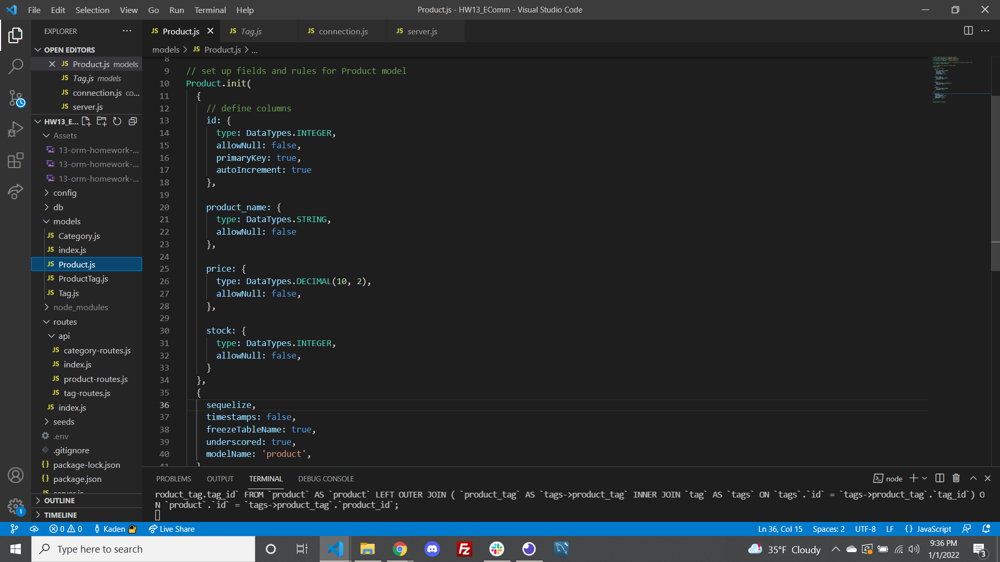
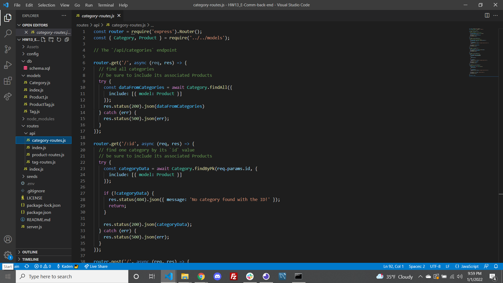
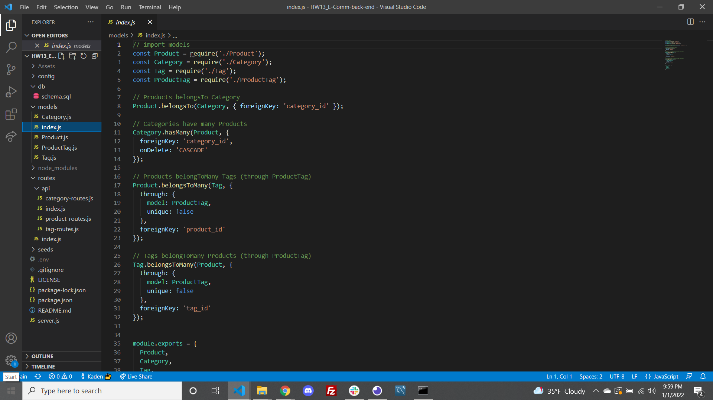

# HW13_E-Comm-back-end
---
(https://opensource.org/licenses/MIT)
## INSTRUCTIONS
This project is designed to take to allow user to create, edit and delete data in an existing database. 

##Table of Contents
*[Installation:] (#installation)
*[Usage:] (#usage)
*[License:](license)
*[Contribution:] (#contributing)
*[Testing:] (#tests)
*[Questions?](#questions)

##Installation
To install this app so that it functions properly, open the integrated terminal tied to the current project folder, then run 'npm install' in your terminal. This should download all necessary packages.

##Usage
You can use this project to allow users to add new products, tags, and categories to a dataset. These can be used to help sort and find products based on product names, products based on category, by price or by stock. The user will setup a server using the npm packages Node and Sequelize to build and modify the database. Insomonia is used to test the different user requests.

##Example
Here you can see some key elements within the code, that ensures that these objects are possible to create, that the path is being directed to the right location and how the these different data sets relate to one another:

 # License
            This project is license under the MIT license
            

##Contributing
Users can contribute to this project by playing with the code given and identifying more elaborate features that can be added to this program!

##Tests
This project can be tested by installing the necessary packages, seeding the database then running the program on your local server to be tested via insomnia, postman or tools alike.

##Questions

    If you have any questions regarding the repository published, please feel free to reach out to me at kadenkelsey33@gmail.com,
    if you would like to look at the code that made this application, you can find this under my repos in GitHub. My GitHub
    username is K-Kelsey
    
